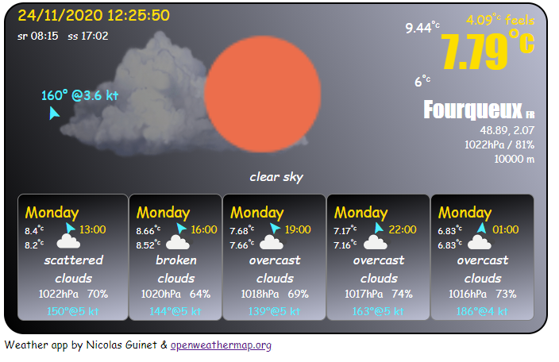
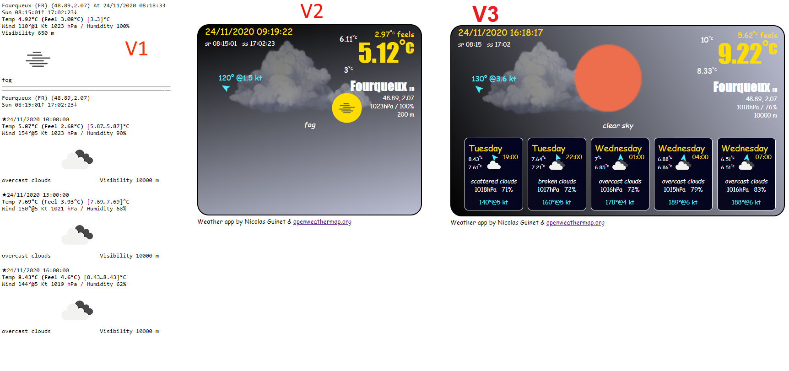

# Weather App

A portofio must have!

# How to use  
- Register to https://api.openweathermap.org  
- Get an APi key and inject it into index.html  
> var API_KEY = '08.....a79';		 
- I have changed the original api key that i've used in development !  

# Data provider
- https://api.openweathermap.org

## Weather pictures (free)
- https://toppng.com/cloud-png-PNG-free-PNG-Images_112785
- https://toppng.com/show_download/1269/sun/large

## Progression
