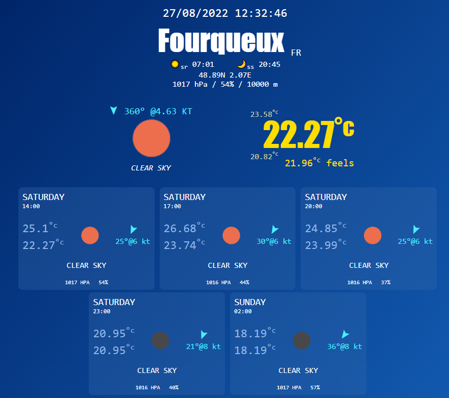
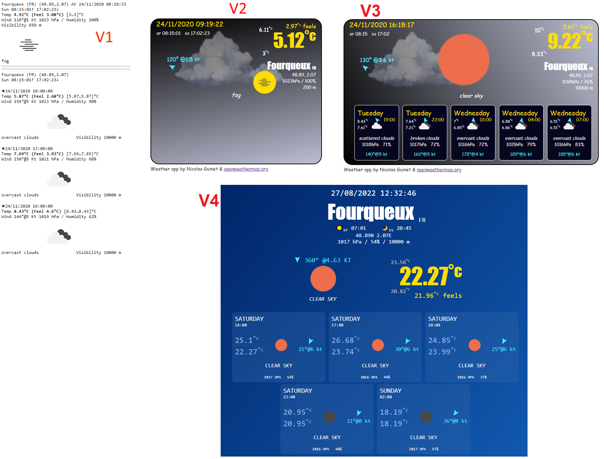

# Weather App

Weather app is portfolio must have!



# Configuration

- Register to the data provider [https://api.openweathermap.org ](https://api.openweathermap.org)
- Get an API key
- Inject the API key into index.js (development api key you can see below is no more valid):

```js
const config = {
	apiKey: "081dd463b40fb90f333a233324528a78", // Get an api Key here: https://api.openweathermap.org
	useNavigatorGeolocation: false,
	location: { lat: 48.89, lon: 2.07 },
	maxForecasts:5								// Max is 5 (openweathermap free plan) 
};
```

# How to use

>Open index.html

## Weather pictures (free)

- https://toppng.com/cloud-png-PNG-free-PNG-Images_112785
- https://toppng.com/show_download/1269/sun/large

# Development Progression



## Contributing

Wow, thanks to contribute to this project!   
New ideas, samples, forks...are welcome.  
So please just fork it, commit, push and send me a pull request to main.  

## License

This project is licensed under the [MIT License](LICENSE)

